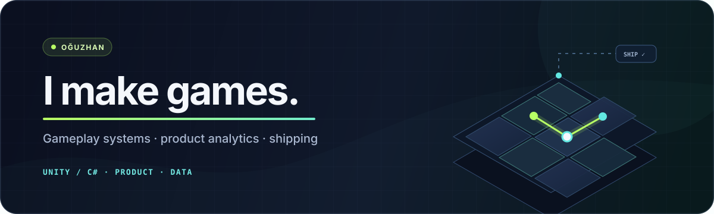

<a href="https://oguzhan-ozdemir.vercel.app/">
  <picture>
    <source media="(max-width: 600px)" srcset="./assets/profile-banner-mobile.svg">
    
  </picture>
</a>

Game developer and technical product lead in Istanbul.

[Portfolio](https://oguzhan-ozdemir.vercel.app/) · [LinkedIn](https://www.linkedin.com/in/oguzhanozfe/) · [Playable work](https://hr-crossroads-demo.vercel.app/)

I work across Unity gameplay, backend services, player analytics and release
decisions. At Woofy Games, I lead development and product delivery for Ball
Match while managing five direct reports and staying close to the code. I
previously co-founded Limina Games and built simulation software at ADASTEC.

## Selected public work

| Project | What it shows |
|---|---|
| [Blast Puzzle Systems](https://github.com/oguzhanozfe/unity-blast-puzzle-demo) | A playable Unity puzzle core with deterministic refill, power-ups, six EditMode tests and a clean reproducible build. |
| [Progression Systems](https://github.com/oguzhanozfe/unity-progression-systems-demo) | Durable XP progression and queued navigation kept separate from Unity presentation code, with five EditMode tests. |
| [Game Product Analytics Lab](https://github.com/oguzhanozfe/game-product-analytics-lab) | Synthetic event contracts, data-quality checks, funnel and retention SQL, build comparison and a bounded product decision note. |
| [Turkish Finance Data](https://github.com/oguzhanozfe/turkish-finance-data) | Source-aware data imports, provenance checks and a self-contained research snapshot generated without runtime dependencies. |
| [HR Crossroads](https://github.com/oguzhanozfe/hr-crossroads-unity) | A live Unity/WebGL workplace simulation with 243 validated content paths and clear limits on how its output may be used. |
| [Steam Discovery](https://github.com/oguzhanozfe/steam-discovery) | A searchable research library for Steam visibility and game marketing, built around linked sources and structured metadata. |
| [Enterprise Implementation Lab](https://github.com/oguzhanozfe/enterprise-implementation-lab) | A synthetic path from requirements through acceptance behavior, UAT, training, rollout and rollback decisions. |

## Shipped game work

- At Woofy Games, I work on Ball Match across progression, difficulty, hints,
  economy, Firebase services, analytics and release validation. The game is on
  the [App Store](https://apps.apple.com/app/id6760407545) and
  [Google Play](https://play.google.com/store/apps/details?id=com.woofygames.ballmatch).
- At Limina Games, I worked across development, planning and marketing for four
  standalone VR projects with more than 200K cumulative installs. My technical
  work included an Amazon S3 video workflow for Viral Descent and the Next.js
  product site for Please Step Aside.
- At ADASTEC, I built C++ and Unreal Engine simulation workflows on Linux with
  localization and perception teams.

Studio and client repositories stay private when they contain company code,
licensed assets or customer material. The public projects above are scoped so
their code, data and claims can be reviewed on their own.

## Tools I use

`Unity / C#` · `Unreal / C++` · `Python` · `TypeScript / Node.js` · `Firebase`
· `Next.js / React` · `Amazon S3` · `BigQuery SQL` · `Git / CI`

## Contact

[Portfolio](https://oguzhan-ozdemir.vercel.app/) ·
[LinkedIn](https://www.linkedin.com/in/oguzhanozfe/) · Istanbul, Türkiye
